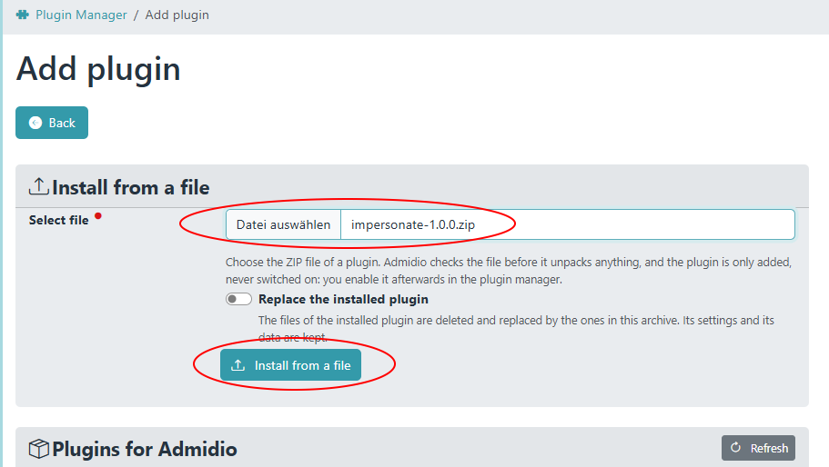
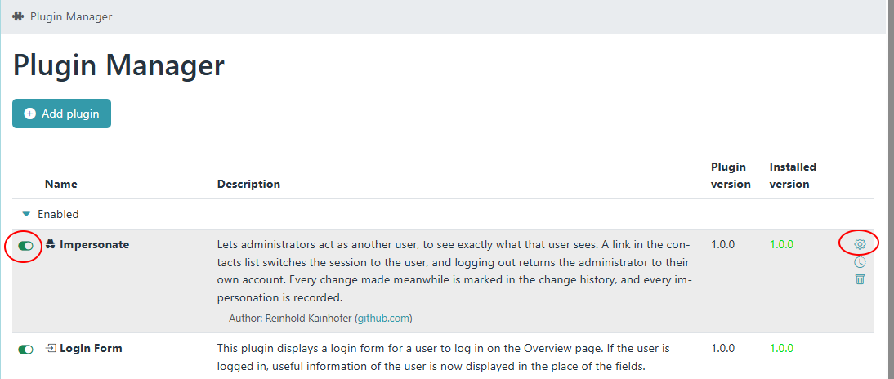
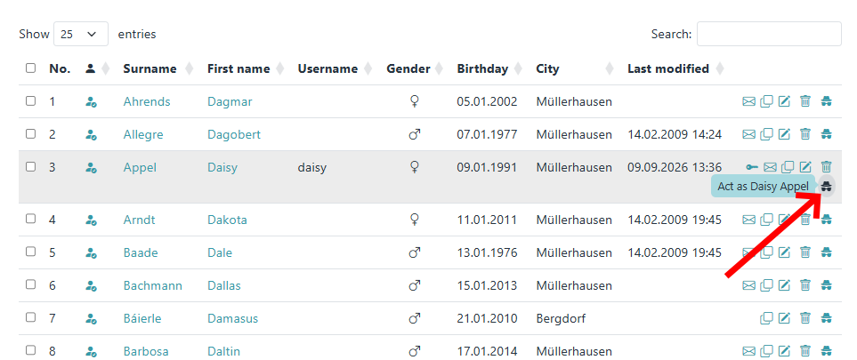
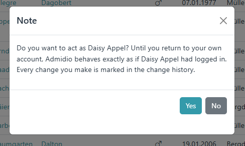
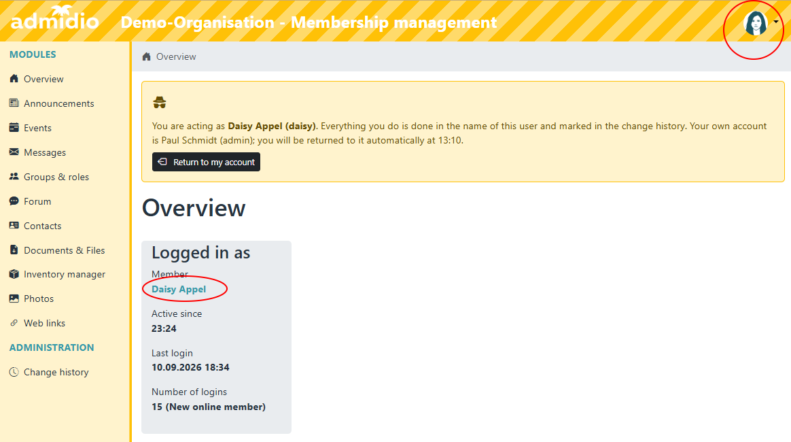
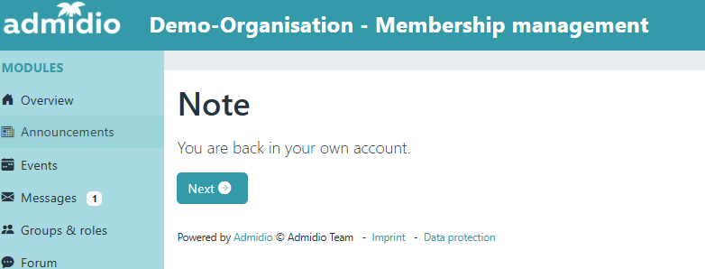
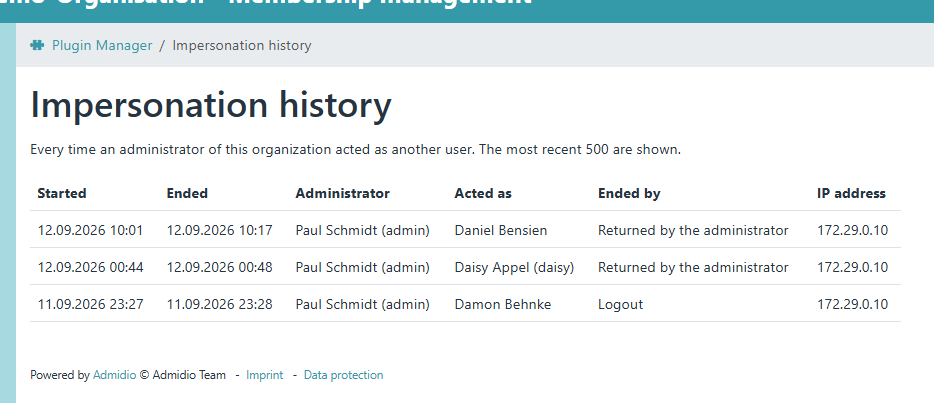
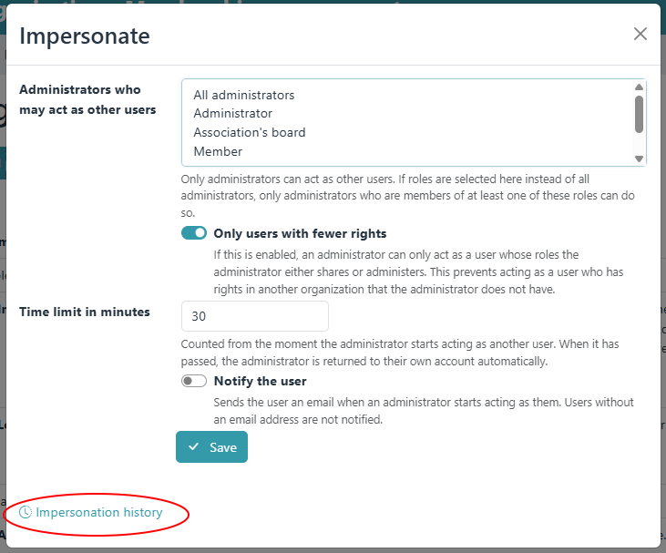

# Admidio Impersonate Plugin — act as another user

A third-party plugin for Admidio 6.0 and later that lets an administrator act as another user, to make 
changes on behalf of them or to find out why
something does not work for them. For the duration, Admidio behaves exactly as if that user had logged
in: the same menu, the same rights, the same lists and profile fields.


## Installation

As administrator, go to Admidio's plugin manager (Admidio 5.1 or later required!), select "Add plugin" and upload the plugin zip file ''impersonate-1.0.0.zip''.




## How to impersonate

Once the plugin is installed and enabled in Admidio's plugin manager,
the contacts list shows little "impersonate" icons for each user. 





Clicking on it makes the administrator assume the 
identity of the corresponding user. 



While impersonating another user, the design of the Admidio installation changes clearly 
to keep the administrator reminded. After a certain, configurable time, the impersonation 
is automatically ended and the session returns to the administrator user. Manual logout 
before the timeout also ends the impersonation.



## What it does

* **Contacts list:** administrators get an *Act as …* icon in every row of a user they may act as.
  After a confirmation the session belongs to that user.
* **Visible on every page:** while acting as a user, the header bar is striped, the sidebar is
  tinted, and a banner names the user, the administrator and the time at which the session returns
  automatically. The banner has a *Return to my account* button.
* **Logout returns:** logging out while acting as a user returns the administrator to their own
  account instead of ending the session. A second logout logs out normally.
* **Change history:** every change made while acting as a user is stored with a comment
  *Impersonated by Firstname Lastname (username)*. The change history shows an asterisk after the row
  number of such a change, with the comment as its tooltip.
* **Profile change notifications** name the administrator:
  *… was changed by Anna Muster (login: anna) [impersonated by Max Admin (max)]*.
* **History:** every impersonation is recorded with the administrator, the user, the start, the end,
  how it ended and the IP address. The preferences panel links to the history page.



## What is refused while acting as a user

* **Single sign-on** (`modules/sso/index.php`): no other application may be logged in with the
  identity of the user.
* **Sending messages, emails and e-cards** (`messages_send.php`, `ecard_send.php`): nothing goes out
  in the name of the user. Reading messages and opening the message form stay possible.

Everything else is allowed, including changing the password, the email address or deleting the
account — an administrator can do all of that without acting as the user as well.


## Settings

*Administration → Preferences → Login & security → Impersonate*




| Setting | Default | Meaning |
|---|---|---|
| Administrators who may act as other users | All administrators | Only administrators can ever act as other users. Selecting roles restricts it to administrators who are members of at least one of them. |
| Only users with fewer rights | on | An administrator can only act as a user whose roles they share or administer. This stops an administrator of one organization from acting as a user with rights in another organization. |
| Time limit in minutes | 30 | Counted from the start. When it has passed, the administrator is returned to their own account. |
| Notify the user | off | Sends the user an email when an administrator starts acting as them. |

## How it works

Admidio knows who is logged in from one value, `ses_usr_id` of the session. Acting as a user writes
that user into the session and replaces the user object the session keeps — what the login does, and
nothing else of it: the login counter and last login of the user are not touched.

The session keeps its PHP session ID and its external session ID, so the single sign-on sessions of the
administrator survive the impersonation. The authentication time and methods, which the single sign-on
endpoints issue their assertions from, are removed from the session while it lasts and restored
afterwards — the endpoints stay closed even if the plugin is disabled in the middle of an
impersonation.

The PHP session remembers who the administrator is, and the table `adm_plugin_impersonations` keeps
the record. Returning requires both to agree; if they do not, the session is logged out instead.

## Limits

* The impersonation belongs to the PHP session, so every browser tab of the session acts as the user.
* An impersonation that is never ended — the browser is closed — is shown in the history as not
  ended once its time limit has passed.
* Disabling the plugin in the middle of an impersonation leaves the session with the user until it
  expires or is logged out; single sign-on stays unavailable to it.
* System emails other than the profile change notification (event registrations, for example) are
  sent as they would be for the user.

## Tests

`tests/Unit` and `tests/Integration` run with the Admidio suite, e.g.

```
php vendor/bin/phpunit plugins/impersonate/tests
```
